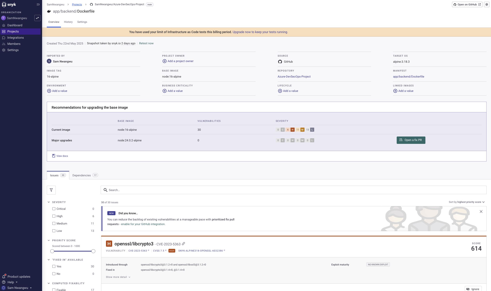

# Azure DevSecOps CI/CD Project
A comprehensive end-to-end DevSecOps project implementing a secure three-tier web application on Azure Kubernetes Service using industry best practices for security, CI/CD, GitOps, and monitoring.

<div align="center">
  
</div>

## 📋 Table of Contents

- [Architecture Overview](#architecture-overview)
- [Tools & Technologies](#tools--technologies)
- [Project Implementation](#project-implementation)
- [Infrastructure Provisioning](#infrastructure-provisioning)
- [CI/CD Pipeline](#cicd-pipeline)
- [GitOps Configuration](#gitops-configuration)
- [Monitoring Setup](#monitoring-setup)
- [Security Features](#security-features)
- [Monitoring Dashboards](#monitoring-dashboards)
- [Results & Benefits](#results--benefits)
- [Next Steps](#next-steps)
- [About](#about)

## 🏗️ Architecture Overview

This project demonstrates a complete DevSecOps pipeline for deploying and managing a containerised three-tier web application on Azure Kubernetes Service. The architecture leverages Infrastructure as Code, CI/CD automation, security scanning, and comprehensive monitoring to deliver a secure and reliable application platform.

## 🛠️ Tools & Technologies

**Cloud Infrastructure**

* Azure (Entra, AKS, Application Gateway, Azure DNS, Azure CLI)
* Terraform (Infrastructure as Code)

**CI/CD Pipeline**

* GitHub Actions (CI/CD workflow automation)
* ArgoCD (GitOps continuous delivery)

**Security Scanning**

* SonarQube (SAST code quality analysis)
* Snyk (Dependency vulnerability scanning)
* Trivy (Container image vulnerability scanning)
* Microsoft Defender for Containers (Runtime security)

**Containerization & Orchestration**

* Docker (Application containerization)
* Azure Container Registry (Container image repository)
* Azure Kubernetes Service (Container orchestration)
* Helm (Kubernetes package management)

**Monitoring & Observability**

* Azure Monitor (Platform monitoring)
* Prometheus (Metrics collection)
* Grafana (Dashboards and visualization)
* Azure Application Insights (Application performance monitoring)

## 💻 Project Implementation

### Infrastructure Provisioning with Terraform

The project uses Terraform to provision all required Azure infrastructure:

```hcl
# main.tf excerpt

# Create Resource Group
resource "azurerm_resource_group" "rg" {
  name    = var.resource_group_name
  location = var.location
}

# Create Azure Kubernetes Service
resource "azurerm_kubernetes_cluster" "aks" {
  name                = var.cluster_name
  location            = azurerm_resource_group.rg.location
  resource_group_name = azurerm_resource_group.rg.name
  dns_prefix          = var.dns_prefix

  default_node_pool {
    name       = "default"
    node_count = var.node_count
    vm_size    = var.vm_size
  }

  identity {
    type = "SystemAssigned"
  }

  network_profile {
    network_plugin    = "azure"
    load_balancer_sku = "standard"
  }
}

# Create Container Registry
resource "azurerm_container_registry" "acr" {
  name                = var.acr_name
  resource_group_name = azurerm_resource_group.rg.name
  location            = azurerm_resource_group.rg.location
  sku                 = "Standard"
  admin_enabled       = false
}
```

### CI/CD Pipeline with GitHub Actions

The project implements a comprehensive CI/CD pipeline using GitHub Actions:


### ArgoCD Configuration for GitOps

ArgoCD is used to implement GitOps principles for continuous delivery:


### Monitoring Setup

The project includes comprehensive monitoring with Prometheus and Grafana:

```yaml
# prometheus/prometheus.yaml excerpt

apiVersion: v1
kind: ConfigMap
metadata:
  name: prometheus-config
  namespace: monitoring
data:
  prometheus.yml: |
    global:
      scrape_interval: 15s
    scrape_configs:
      - job_name: 'kubernetes-pods'
        kubernetes_sd_configs:
          - role: pod
        relabel_configs:
          - source_labels: [__meta_kubernetes_pod_annotation_prometheus_io_scrape]
            action: keep
            regex: true
```

## Working Application:


## Working Services:


## 🔒 Security Features

* Static Application Security Testing (SAST) with SonarQube
* Software Composition Analysis (SCA) with Snyk
* Runtime Protection with Microsoft Defender for Containers
* Network Security with Azure Network Security Groups
* Secret Management using Azure Key Vault
* RBAC implementation for AKS and Azure resources

## Security Scanning
This project implements comprehensive security scanning with:
- SonarQube for static code analysis
- Snyk for dependency vulnerability scanning
- Kubernetes security policies for runtime protection

## 📊 Monitoring Dashboards

The project includes comprehensive monitoring dashboards:

<div align="center">
<table>
  <tr>
    <td width="50%">
      <strong>Grafana - Kubernetes Cluster Health</strong><br/>
      
    </td>
    <td width="50%">
      <strong>SonarQube SAST</strong><br/>
      
    </td>
  </tr>
  <tr>
    <td colspan="2" align="center">
      <strong>Snyk SCA</strong><br/>
      
    </td>
  </tr>
</table>
</div>

## 🚀 Results & Benefits

This CI/CD implementation delivers:

* ✅ Enhanced Security: Comprehensive security scanning and monitoring
* ✅ Deployment Automation: Consistent, repeatable deployments using GitOps
* ✅ Infrastructure as Code: Reproducible infrastructure with Terraform
* ✅ Observability: Complete monitoring of infrastructure and applications
* ✅ Scalability: Leveraging Azure's managed Kubernetes service for growth

## 🔮 Next Steps

* Implement Dynamic Application Security Testing (DAST) with OWASP ZAP
* Implement blue-green deployment strategy
* Add chaos engineering tests
* Integrate cost optimization tools
* Implement policy as code with Open Policy Agent

## 📝 About

This project demonstrates the implementation of DevSecOps best practices for deploying secure, containerized applications on Azure Kubernetes Service. It integrates CI/CD automation, security scanning, GitOps principles, and comprehensive monitoring to deliver a robust and reliable application platform.

<div align="center">
  
</div>
